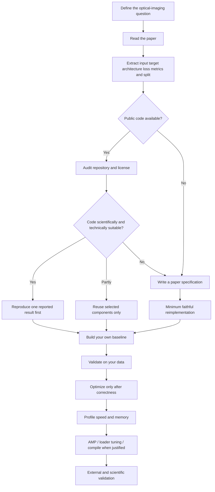
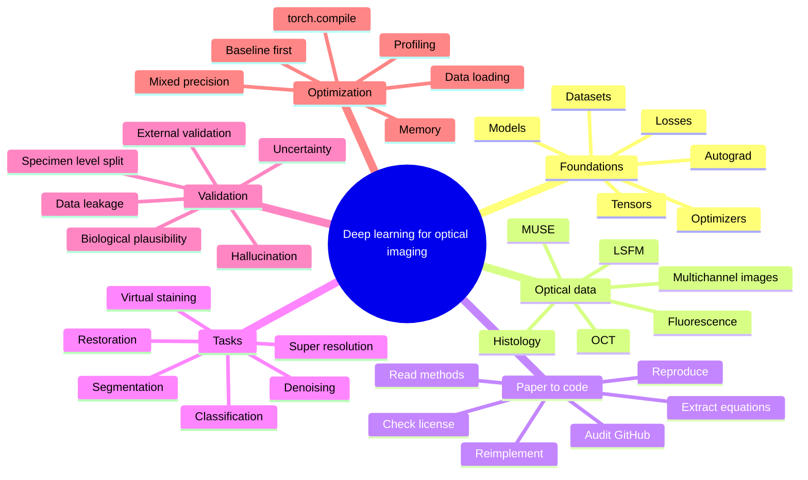

# Deep Learning for Optical Imaging

**Author: Md. Mobarak Karim, Ph.D.**

A practical research course for learning deep learning in the context of **optical and biomedical imaging**. The goal is not simply to train neural networks. The goal is to learn how to move responsibly from a scientific paper or imaging problem to a reproducible, validated implementation.

This course emphasizes OCT, fluorescence microscopy, light-sheet microscopy, MUSE/slide-free histology, virtual staining, image segmentation, denoising/restoration, and related optical-imaging workflows.

## The core question this course teaches you to answer

When you find a promising paper, you should be able to decide:

> **Should I use the authors' code, adapt selected parts, reimplement the method myself, or reject the method for my problem?**

The authors do not make this decision for your project. You make it from evidence: task match, data match, license, code quality, reproducibility, preprocessing, metrics, hardware requirements, and scientific validation.

## Research workflow



## Learning mind map



## Course order

| Lesson | Topic | Main question |
|---|---|---|
| [`00_setup_reproducibility.ipynb`](00_setup_reproducibility.ipynb) | Setup + reproducibility | Is my environment and experiment traceable? |
| [`01_tensors_autograd_models.ipynb`](01_tensors_autograd_models.ipynb) | PyTorch foundations | What actually happens in a training step? |
| [`02_optical_imaging_datasets.ipynb`](02_optical_imaging_datasets.ipynb) | Optical datasets | How should imaging data be represented and split? |
| [`03_cnn_training_baseline.ipynb`](03_cnn_training_baseline.ipynb) | CNN baseline | Can I build a simple correct baseline first? |
| [`04_read_a_paper_like_an_engineer.ipynb`](04_read_a_paper_like_an_engineer.ipynb) | Paper reading | What information must I extract before coding? |
| [`05_audit_authors_code.ipynb`](05_audit_authors_code.ipynb) | GitHub/code audit | Should I use the authors' implementation? |
| [`06_reproduce_authors_repository.ipynb`](06_reproduce_authors_repository.ipynb) | Reproduction | Can I reproduce one authors' result before adapting it? |
| [`07_reimplement_from_paper.ipynb`](07_reimplement_from_paper.ipynb) | Reimplementation | What if the code is absent, outdated, or unsuitable? |
| [`08_segmentation_unet.ipynb`](08_segmentation_unet.ipynb) | Segmentation | How do I build and validate a U-Net-style baseline? |
| [`09_denoising_restoration.ipynb`](09_denoising_restoration.ipynb) | Restoration | How do I denoise without erasing or inventing structures? |
| [`10_virtual_staining_translation.ipynb`](10_virtual_staining_translation.ipynb) | Virtual staining | How should image-to-image translation be validated? |
| [`11_small_data_transfer_learning.ipynb`](11_small_data_transfer_learning.ipynb) | Small data | What should I do when biomedical data are limited? |
| [`12_validation_leakage_hallucination.ipynb`](12_validation_leakage_hallucination.ipynb) | Scientific validation | Is the result real, generalizable, and biologically defensible? |
| [`13_optimization_amp_profiler_compile.ipynb`](13_optimization_amp_profiler_compile.ipynb) | Optimization | How do I make a correct implementation faster? |
| [`14_final_paper_to_code_project.ipynb`](14_final_paper_to_code_project.ipynb) | Final project | Can I take one optical-imaging paper from audit to validated implementation? |

## Decision rule: authors' code vs your own implementation

Use the authors' code as a **reference implementation**, not as automatic truth.

### Strong reason to reuse it

- the task and input/target definition match your problem;
- the license permits your intended use;
- preprocessing and data split are documented;
- model architecture and loss match the paper;
- training/inference scripts are available;
- you can reproduce at least one reported behavior or metric;
- dependency and hardware requirements are reasonable;
- the code can be isolated in a reproducible environment.

### Strong reason to reimplement

- no usable license;
- repository is incomplete or only contains inference code;
- critical preprocessing is hidden;
- code and paper disagree;
- obsolete dependencies make reproduction fragile;
- the implementation is tightly coupled to unrelated infrastructure;
- your task differs enough that adaptation would be more confusing than a clean baseline;
- you cannot establish what produces the reported result.

See [`CODE_REUSE_DECISION_GUIDE.md`](CODE_REUSE_DECISION_GUIDE.md) and [`PAPER_TO_CODE_CHECKLIST.md`](PAPER_TO_CODE_CHECKLIST.md).

## Optimization principle

Never optimize a pipeline you have not shown to be correct.

```text
correctness
    ↓
valid split + meaningful metric
    ↓
small-data overfit test
    ↓
reproducible baseline
    ↓
measure time and memory
    ↓
fix data bottlenecks
    ↓
AMP / batch strategy
    ↓
profile
    ↓
torch.compile when useful
    ↓
scale hardware only if needed
```

Current PyTorch uses `torch.amp` / `torch.autocast` for automatic mixed precision. `torch.profiler` should be used to identify real bottlenecks rather than guessing. `torch.compile` can improve performance, but compilation overhead and graph breaks mean it should be benchmarked rather than assumed to help every model.

## Optical-imaging safety rule

> **A prettier output is not automatically a more scientifically correct output.**

For restoration, virtual staining, super-resolution, reconstruction, or modality translation, always investigate whether the network can remove real structures or create plausible structures unsupported by the measured data.

Metrics such as PSNR or SSIM are useful but not sufficient by themselves. Validation should also reflect the scientific task: morphology, resolution, contrast, quantitative intensity behavior, specimen-level generalization, acquisition variation, and domain shift.

## Companion guides

- [`OPTICAL_IMAGING_CHEATSHEET.md`](OPTICAL_IMAGING_CHEATSHEET.md) — model/loss/metric starting points for optical imaging.
- [`PAPER_TO_CODE_CHECKLIST.md`](PAPER_TO_CODE_CHECKLIST.md) — reusable paper audit sheet.
- [`CODE_REUSE_DECISION_GUIDE.md`](CODE_REUSE_DECISION_GUIDE.md) — decide reuse/adapt/reimplement/reject.
- [`EXPERIMENT_CHECKLIST.md`](EXPERIMENT_CHECKLIST.md) — before, during, and after training.
- [`REFERENCES.md`](REFERENCES.md) — primary documentation and research references.

## Installation

Create a dedicated environment. Install PyTorch using the command appropriate for your operating system/GPU from the official PyTorch installation selector, then install the remaining course packages.

```bash
python -m venv .venv

# Windows
.venv\Scripts\activate

# macOS/Linux
source .venv/bin/activate

python -m pip install -r requirements.txt
jupyter lab
```

Check the installation:

```python
import torch
print(torch.__version__)
print(torch.cuda.is_available())
if torch.cuda.is_available():
    print(torch.cuda.get_device_name(0))
```

## Data policy

Do not put private, patient-identifiable, proprietary, or unpublished research data in a public repository. Keep authoritative raw data unchanged. Store split manifests and metadata needed to reproduce the experiment.

## Scope

This course is beginner-to-research-practical. It emphasizes reasoning, implementation, validation, and reproducibility. It does not attempt to be an exhaustive treatment of every modern architecture.

## Author

**Md. Mobarak Karim, Ph.D.**  
GitHub: [Mobarak-Karim](https://github.com/Mobarak-Karim)

## License

Course material is released under the MIT License. External paper repositories, pretrained weights, datasets, and figures retain their own licenses and must be checked separately.
