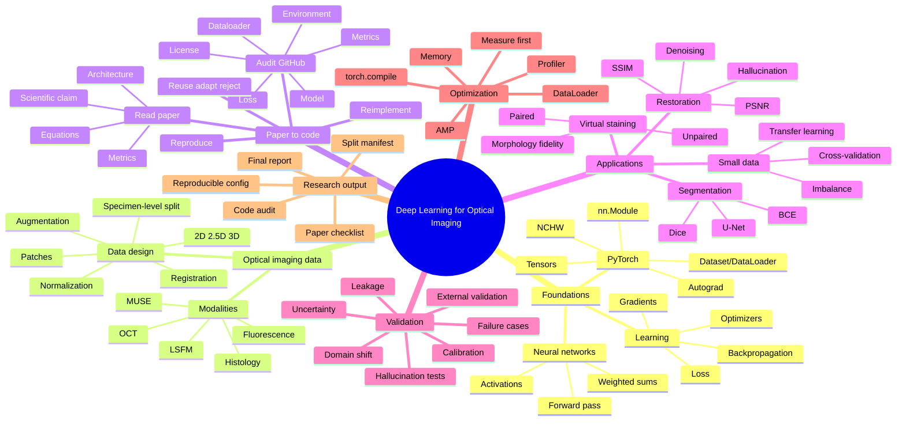
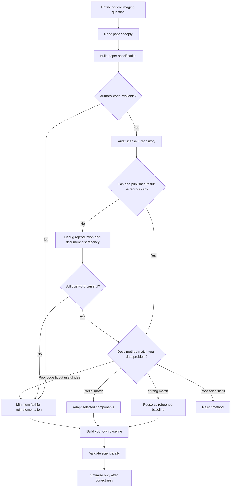

# Deep Learning for Optical Imaging

**Author: Md. Mobarak Karim, Ph.D.**

A self-contained, research-practical course for learning deep learning in the context of **optical and biomedical imaging**. The course is designed so that a motivated beginner can move from basic deep-learning concepts to reading a paper, auditing the authors' code, reproducing it, deciding whether to reuse/adapt/reimplement it, validating the method scientifically, and optimizing the implementation.

The course emphasizes OCT, fluorescence microscopy, light-sheet microscopy, MUSE/slide-free histology, virtual staining, segmentation, denoising/restoration, and related optical-imaging workflows.

## What makes this course different

This is not a "copy a PyTorch model and train it" course. Every lesson asks:

1. **What problem am I solving?**
2. **What is the scientific input and target?**
3. **What equation or modeling assumption is being used?**
4. **Why is this architecture/loss/metric reasonable?**
5. **What can go wrong?**
6. **How will I prove the result is valid?**
7. **Should I reuse authors' code, adapt it, reimplement it, or reject it?**
8. **How should I optimize only after correctness?**

## Complete learning map



## The central research decision



## Course order

| Lesson | Topic | Main question |
|---|---|---|
| [`00_setup_reproducibility.ipynb`](00_setup_reproducibility.ipynb) | Setup + reproducibility | Can another researcher reconstruct my experiment? |
| [`01_tensors_autograd_models.ipynb`](01_tensors_autograd_models.ipynb) | Deep-learning foundations | What does a neural network actually compute and learn? |
| [`02_optical_imaging_datasets.ipynb`](02_optical_imaging_datasets.ipynb) | Optical-imaging data | How should images, specimens, patches, normalization, and splits be designed? |
| [`03_cnn_training_baseline.ipynb`](03_cnn_training_baseline.ipynb) | CNN + training baseline | Can I build and debug a simple correct baseline first? |
| [`04_read_a_paper_like_an_engineer.ipynb`](04_read_a_paper_like_an_engineer.ipynb) | Read a paper | How do I convert paper prose/figures/equations into an implementation specification? |
| [`05_audit_authors_code.ipynb`](05_audit_authors_code.ipynb) | Audit authors' code | Should I trust/reuse this GitHub repository? |
| [`06_reproduce_authors_repository.ipynb`](06_reproduce_authors_repository.ipynb) | Reproduction | Can I reproduce one reference result before changing the code? |
| [`07_reimplement_from_paper.ipynb`](07_reimplement_from_paper.ipynb) | Reimplementation | What is the cleanest process when public code is missing, broken, or unsuitable? |
| [`08_segmentation_unet.ipynb`](08_segmentation_unet.ipynb) | Segmentation | How do U-Net, BCE, Dice, thresholds, and optical QC fit together? |
| [`09_denoising_restoration.ipynb`](09_denoising_restoration.ipynb) | Denoising/restoration | How do I improve image quality without deleting or inventing structures? |
| [`10_virtual_staining_translation.ipynb`](10_virtual_staining_translation.ipynb) | Virtual staining | How do pairing, registration, losses, GANs, color, and morphology validation interact? |
| [`11_small_data_transfer_learning.ipynb`](11_small_data_transfer_learning.ipynb) | Small biomedical data | How do I work honestly with few independent specimens? |
| [`12_validation_leakage_hallucination.ipynb`](12_validation_leakage_hallucination.ipynb) | Scientific validation | Is performance real, generalizable, and biologically defensible? |
| [`13_optimization_amp_profiler_compile.ipynb`](13_optimization_amp_profiler_compile.ipynb) | Optimization | How do I make a correct implementation faster and more memory-efficient? |
| [`14_final_paper_to_code_project.ipynb`](14_final_paper_to_code_project.ipynb) | Final project | Can I take one paper from selection to validated implementation? |

## How each notebook is designed

Each lesson contains:

- a learning mind map;
- concepts explained before code;
- equations translated into programming logic;
- heavily commented examples;
- optical-imaging-specific examples;
- decision rules (when to use / when not to use);
- common failure modes;
- validation questions;
- research checklists;
- worked reasoning examples.

## Companion guides

- [`DEEP_LEARNING_CHEATSHEET.md`](DEEP_LEARNING_CHEATSHEET.md) — neural-network/PyTorch concepts and training workflow.
- [`OPTICAL_IMAGING_CHEATSHEET.md`](OPTICAL_IMAGING_CHEATSHEET.md) — model/loss/metric/validation starting points for OCT, fluorescence, MUSE, virtual staining, segmentation, restoration, and classification.
- [`PAPER_TO_CODE_CHECKLIST.md`](PAPER_TO_CODE_CHECKLIST.md) — complete paper specification template.
- [`CODE_REUSE_DECISION_GUIDE.md`](CODE_REUSE_DECISION_GUIDE.md) — evidence-based reuse/adapt/reimplement/reject decision.
- [`EXPERIMENT_CHECKLIST.md`](EXPERIMENT_CHECKLIST.md) — before/during/after training.
- [`REFERENCES.md`](REFERENCES.md) — official PyTorch and scientific-imaging references.

## Recommended research workflow

```text
scientific question
→ define independent biological unit
→ establish simple baseline
→ read candidate paper
→ extract exact method specification
→ audit code/license
→ reproduce one reference result
→ decide reuse/adapt/reimplement/reject
→ tiny-set overfit test
→ train on valid specimen split
→ validate metrics + failure cases
→ test domain shift / hallucination risk
→ profile time and memory
→ optimize one bottleneck at a time
→ freeze final model and test once
→ report limitations and reproducibility information
```

## Installation

Use a dedicated environment. Install PyTorch from the official selector appropriate for your operating system and GPU, then install the remaining course packages.

```bash
python -m venv .venv

# Windows
.venv\Scripts\activate

# macOS/Linux
source .venv/bin/activate

python -m pip install -r requirements.txt
jupyter lab
```

Check PyTorch:

```python
import torch
print(torch.__version__)
print(torch.cuda.is_available())
if torch.cuda.is_available():
    print(torch.cuda.get_device_name(0))
```

## Data policy

Do not commit private, patient-identifiable, proprietary, or unpublished research data to this public repository. Keep authoritative raw data unchanged. Save split manifests and metadata necessary to reproduce the experiment.

## Scientific rule for generated/restored images

> **A visually attractive deep-learning output is not automatically a scientifically correct output.**

For restoration, super-resolution, reconstruction, virtual staining, or modality translation, explicitly test whether the model removes real structures or creates plausible structures unsupported by the measurement.

## Author

**Md. Mobarak Karim, Ph.D.**  
GitHub: [Mobarak-Karim](https://github.com/Mobarak-Karim)

## License

New course material is released under the MIT License. External repositories, pretrained weights, datasets, and figures retain their own licenses and must be checked independently.
